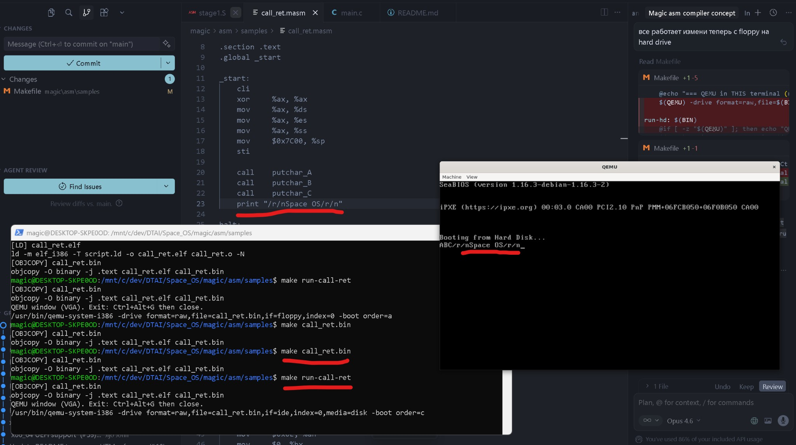

# SPACE-OS

**Multi-Architecture Operating System with GUI**
**Agentic Reactive Computation Device Modular Operating System**
**Based on Vib-OS as first foundation**


```
   ____  ____     _     _____  _____      ___  ____  
  / ___||  _ \   / \   |  ___)|  ___)    / _ \/ ___|
  \___ \| |_) | /___\  | |    | |___    | | | \___ \
   ___) |  __/ / ___ \ | |___ | |___    | |_| |___) |
  |____/|_|   /_/   \_\|_____)|_____)    \___/|____/  

SPACE-OS v0.0.1 - Agentic Modular OS with AI built in integrated into the system
```

Current work:
- Adding magic assembler fully assembles instructions to .o format! (magic/asm)

<p align="center">
  
</p>

## Overview

SPACE-OS is a Modular AI based operation system. Built with **25,000+ lines** of C and Assembly, it runs natively on QEMU, real hardware (Raspberry Pi 4/5, x86_64 PCs), and Apple Silicon.
It contains own's programming language: Magic.
Magic is a root language of this OS, it will be fully integrated into the system.
Magic is support programming on kernel & user side.

## 🎯 Multi-Architecture Support

| Architecture | Boot Method | Status | Hardware |
|--------------|-------------|--------|----------|
| **ARM64** | Direct / UEFI | ✅| Raspberry Pi 4/5, QEMU virt, Apple Silicon (VM) |
| **x86_64** | Direct / UEFI / BIOS | ✅  will be released soon. | Modern PCs, QEMU, VirtualBox, VMware |
| **x86** | Direct / BIOS (MBR) | ✅ **Builds Successfully** | Legacy PCs, QEMU pc |

### What Works Now

- ✅ **ARM64**: Fully tested and stable on QEMU and Raspberry Pi
- ✅ **x86_64**: Kernel builds and boots successfully
- ✅ **x86 32-bit**: Kernel builds successfully (testing in progress)
- ✅ **Architecture Abstraction Layer**: Clean separation of arch-specific code
- ✅ **Context Switching**: Working for ARM64, x86_64, and x86
- ✅ **Memory Management**: MMU/paging for all architectures
- ✅ **Interrupt Handling**: GICv3 (ARM64), APIC (x86_64), PIC (x86)

### Standalone x86_64 UEFI 

For a simplified x86_64 build that boots directly from UEFI on real hardware, see the **[vib-os-x86_64](vib-os-x86_64/)** folder. It includes:
- Limine bootloader integration
- Framebuffer graphics with GUI
- JPEG wallpaper support
- Easy `make` build system

Will be:
- Magic programming language
- `mmake` build system
- Magic assembler with AI devices integration
- Magic user level assembler
- Magic user level compiler
- Support of running user agents 

## 📸 Screenshots

### It works!
Space OS booting in QEMU from hard disk (Magic ASM sample: call_ret → ABC + "Space OS").

<p align="center">
  
</p>

### Main Desktop

*SPACE-OS desktop with animated dock, menu bar, and wallpaper system.*

## 🚀 Quick Start

### Prerequisites

**macOS:**
```bash
# Install Xcode Command Line Tools
xcode-select --install

# Install QEMU
brew install qemu
```

**Linux:**
```bash
# Ubuntu/Debian
sudo apt-get install qemu-system-aarch64 qemu-system-x86 gcc-aarch64-linux-gnu make

# Arch Linux
sudo pacman -S qemu-system-aarch64 qemu-system-x86 aarch64-linux-gnu-gcc make
```

### ARM64 (Default - Recommended)

```bash
# Clone the repository
git clone https://github.com/viralcode/vib-OS.git
cd vib-OS

# Build everything (kernel, drivers, userspace)
make all

# Run with GUI (opens QEMU window)
make run-gui

# Or run in text mode
make run

# Or run with QEMU (headless testing)
make qemu
```


### Available Make Targets

```bash
# ARM64 (default Makefile)
make all          # Build everything
make kernel       # Build kernel only
make drivers      # Build drivers only
make libc         # Build C library
make userspace    # Build userspace programs
make image        # Create bootable disk image
make run          # Run in QEMU (text mode)
make run-gui      # Run in QEMU (GUI mode)
make qemu         # Run in QEMU (headless)
make qemu-debug   # Run with GDB server
make clean        # Clean build artifacts

# Multi-Architecture (Makefile.multiarch)
make -f Makefile.multiarch ARCH=arm64 kernel
make -f Makefile.multiarch ARCH=x86_64 kernel
make -f Makefile.multiarch ARCH=x86 kernel
```

## 💾 Creating Bootable Media

### For ARM64 (Raspberry Pi 4/5)

```bash
# Build bootable image
make image

# Write to SD card (replace diskX with your SD card)
# macOS
sudo dd if=image/unixos.img of=/dev/rdiskX bs=4m status=progress

# Linux
sudo dd if=image/unixos.img of=/dev/sdX bs=4M status=progress && sync
```

### For x86_64 PC


## 🧪 Testing

### QEMU (Recommended)

```bash
# ARM64 with GUI
make run-gui

# ARM64 text mode
make run

# ARM64 headless (for CI/automation)
make qemu

# x86_64
make -f Makefile.multiarch ARCH=x86_64 qemu
```

### Real Hardware

#### Raspberry Pi 4/5
1. Build image: `make image`
2. Write to SD card: `sudo dd if=image/unixos.img of=/dev/sdX bs=4M`
3. Insert SD card and power on

#### x86_64 PC
1. Create bootable USB: `./scripts/create-uefi-image.sh`
2. Write to USB: `sudo dd if=vibos-x86_64.img of=/dev/sdX bs=4M`
3. Boot from USB (select UEFI boot in BIOS)

### Apple Silicon (M1/M2/M3/M4)

Use Qemu. 

## 🚧 Current Status & Known Issues

### What Works
- ✅ ARM64 kernel boots and runs stably
- ✅ x86_64 kernel builds successfully
- ✅ GUI system with windows, dock, and applications
- ✅ File system (RamFS) with file manager
- ✅ **EXT4 Read/Write Support** - Full implementation with block/inode allocation
- ✅ Networking (TCP/IP stack, virtio-net)
- ✅ Process management with GUI process manager
- ✅ Multi-threading via clone() syscall
- ✅ SMP infrastructure initialized
- ✅ **Complete sys_execve** - Loads ELF, sets up user stack, jumps to userspace
- ✅ Input (keyboard and mouse)
- ✅ Doom runs with full graphics
- ✅ Python and Nano language interpreters
- ✅ Security features (spinlocks, sandbox, ASLR)

### Known Issues
1. **Sound Support**: Intel HDA driver works but audio may be choppy in QEMU
2. **x86_64 Testing**: Needs more real hardware testing
3. **Network Settings UI**: Not fully implemented
4. **Web Browser**: Basic rendering only, no full HTML parser

### Roadmap
- [x] ~~**Multi-core**: SMP support for multiple CPUs~~ *(Infrastructure complete)*
- [x] ~~**Process Manager**: View and kill running processes~~ *(Done)*
- [x] ~~**Multi-threading**: Thread creation via clone()~~ *(Done)*
- [x] ~~**EXT4 Write Support**: Full read/write with bitmap management~~ *(Done)*
- [x] ~~**Userspace Execution**: Complete sys_execve implementation~~ *(Done)*
- [/] **x86 32-bit**: Complete kernel implementation
- [/] **USB Support**: Add USB mass storage and HID drivers
- [ ] **User Accounts**: Login screen and multi-user support
- [ ] **Package Manager**: Install/remove applications
- [ ] **PNG Support**: Add PNG image decoder
- [ ] **Video Player**: Basic video playback support

## 🤝 Contributing

We welcome contributions! Here's how to get started:

1. **Fork** the repository
2. Create a **Feature Branch** (`git checkout -b feature/NewFeature`)
3. **Commit** your changes (`git commit -m 'Add NewFeature'`)
4. **Push** to the branch (`git push origin feature/NewFeature`)
5. Open a **Pull Request**

### Coding Standards
- Use **C11** standard
- Follow kernel coding style (4-space indentation, K&R braces)
- Test on both ARM64 and x86_64 (if applicable)
- Add comments for complex logic
- Update documentation for new features

### Areas for Contribution
- 🐛 **Bug Fixes**: Fix known issues
- 🎨 **GUI Improvements**: Enhance window manager, add widgets
- 🔧 **Drivers**: Add support for new hardware
- 📦 **Applications**: Create new userspace programs
- 📚 **Documentation**: Improve guides and comments
- 🧪 **Testing**: Test on real hardware and report issues

## 📄 License

This project is licensed under the MIT License - see the [LICENSE](LICENSE) file for details.

**Made with ❤️ by [S190885](serikzhunu@gmail.com)**
